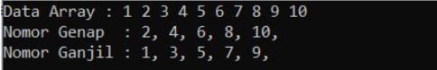

# <h1 align="center">Laporan Praktikum Modul Array</h1>
<p align="center">Valisha Atthalia Naura Irfan - 2311102160</p>

## Dasar Teori

Array merupakan struktur data yang paling dasar. Sebelum mempelajari struktur data lainnya, alangkah baiknya, kita perlu mempelajari Array terlebih dahulu. Berikut ini adalah beberapa jenis array:
1) Array Satu Dimensi
Array satu dimensi adalah tipe variabel yang terdiri dari kumpulan data dengan tipe yang sama yang disusun dalam satu baris atau satu dimensi. Setiap elemen di dalam array memiliki sebuah indeks atau nomor yang digunakan untuk mengakses elemen tersebut. Indeks dimulai dari 0 dan berakhir pada jumlah elemen dikurangi satu.
2) Array Dua Dimensi
Array dua dimensi adalah variable yang terdiri dari kumpulan array satu dimensi dengan tipe yang sama yang disusun dalam baris dan kolom. Dalam array dua dimensi, setiap elemen memiliki dua indeks, yaitu indeks baris dan indeks kolom. Indeks baris menunjukkan posisi elemen dalam baris, sementara indeks kolom menunjukkan posisi elemen dalam kolom.
3) Array Mutidimensi
Array multidimensi memiliki kesamaan dengan array satu dimensi dan dua dimensi, namun memiliki kapasitas memori yang lebih besar. Array ini digunakan untuk merepresentasikan array dengan dimensi lebih dari dua atau array yang memiliki lebih dari dua indeks, seperti array tiga dimensi, array empat dimensi, array lima dimensi, dan seterusnya.
4) Array Banyak Dimensi
Sebenarnya array banyak dimensi ini tidak terlalu sering dipakai seperti halnyaarray satu dimensi, dua dimensi, dan tiga dimensi. Array banyak dimensi ini pada dasarnya sama dengan array sebelimnya kecuali pada jumlah dimensinya..

## Guided 

### 1. [Program Input Array Tiga Dimensi]

```C++
#include <iostream>
using namespace std;
// PROGRAM INPUT ARRAY 3 DIMENSI
int main() {
    // Deklarasi array
    int arr[2][3][3];
    // Input elemen
    for (int x = 0; x < 2; x++) {
        for (int y = 0; y < 3; y++) {
            for (int z = 0; z < 3; z++) {
                cout << "Input Array[" << x << "][" << y << "][" << z << "] = ";
                cin >> arr[x][y][z];
                }
            }
        cout << endl;
    }
    // Output Array
    for (int x = 0; x < 2; x++) {
        for (int y = 0; y < 3; y++) {
            for (int z = 0; z < 3; z++) {
                cout << "Data Array[" << x << "][" << y << "][" << z << "] = " << arr[x][y][z] << endl;
                }
            }
        }
    cout << endl;
    // Tampilan array
    for (int x = 0; x < 2; x++) {
        for (int y = 0; y < 3; y++) {
            for (int z = 0; z < 3; z++) {
            cout << arr[x][y][z] << ends;
            }cout << endl;
        }cout << endl;
    }
}
```
Pada program diatas yaitu mendeklarasikan array tiga dimmensi yang memiliki ukuran yaitu '2 x 3 x 3', yang berarti terdapat dua matriks 3x3. Program juga meminta pengguna memasukkan nilai ke dalam elemen array dengan format 'Array[x][y][z]', setelah array dimasukkan program akan mencetak kembali nilai-nilai yang telah dimasukkan oleh pengguna. Selanjutnya, program akan mencetak ulang nilai-nilai tersebut dengan format matriks untuk tampilan yang lebih rapi dan terstruktur.

### 2. [Program Mencari Nilai Maksimal pada Array]
```C++
#include <iostream>
using namespace std;
int main()
{
    int maks, a, i = 1, lokasi;
    cout << "Masukkan panjang array: ";
    cin >> a;
    int array[a];
    cout << "Masukkan " << a << " angka\n";
    for (i = 0; i < a; i++)
    {
        cout << "Array ke-" << (i) << ": ";
        cin >> array[i];
    }
maks = array[0];
for (i = 0; i < a; i++)
{
    if (array[i] > maks)
    {
        maks = array[i];
        lokasi = i;
    }
}
cout << "Nilai maksimum adalah " << maks << " berada di Array
ke " << lokasi << endl;
}
```
Program ini adalah untuk mengajarkan cara menggunakan array dalam C++, mencari nilai maksimum, dan menampilkan hasilnya. Program ini merupakan contoh sederhana dari pencarian nilai maksimum dalam sebuah array menggunakan loop.


## Unguided 

### 1. [Buatlah program untuk menampilkan Output seperti berikut dengan data yang diinputkan oleh user!]

```C++
#include <iostream>
using namespace std;

int main() {
    int Arr_160; // Ukuran Array yang dimasukkan oleh pengguna
    cout << "> Masukkan ukuran Array: ";
    cin >> Arr_160;

    // Alokasi dinamis array
    int *Valisha_160 = new int[Arr_160]; // Array untuk menyimpan angka genap
    int *Amelia_160 = new int[Arr_160]; // Array untuk menyimpan angka ganjil
    int Genap_160 = 0; // Jumlah angka genap
    int Ganjil_160 = 0; // Jumlah angka ganjil

    // Meminta pengguna memasukkan angka
    cout << "> Masukkan " << Arr_160 << " angka (dipisah pake spasi):\n";
    for (int i = 0; i < Arr_160; ++i) {
        if (!(cin >> Valisha_160[i])) {
            cout << "Input tidak mencukupi atau tidak valid." << endl;
            return 1;
        }
        // Memisahkan angka genap dan ganjil
        if (Valisha_160[i] % 2 == 0) {
            Genap324++;
        } else {
            Amelia_160 [Ganjil_160] = Valisha_160[i];
            Ganjil_160++;
        }
    }

    cout << "\n<<<<< HASIL >>>>>" << endl;

    // Menampilkan data array yang sudah diinput oleh user
    cout << "Data Array   : ";
    for (int i = 0; i < Arr_160; ++i) // Melakukan perulangan untuk menampilkan data array
        cout << Valisha_160[i] << " ";
    cout << endl;

    // Menampilkan angka genap
    cout << "Nomor Genap  : ";
    for (int i = 0; i < Arr324; ++i) {
        if (Valisha_160[i] % 2 == 0)
            cout << Valisha_160[i] << ", ";
    }
    cout << endl;

    // Menampilkan angka ganjil
    cout << "Nomor Ganjil : ";
    for (int i = 0; i < Ganjil_160; ++i) { 
        cout << Ameli_160[i] << ", ";
    }
    cout << endl;

    // Dealokasi memori setelah selesai digunakan
    delete[] Valisha_160;
    delete[] Amelia_160;

    return 0;
}
```
#### Output:


Kode di atas digunakan untuk mencetak teks "ini adalah file code guided praktikan" ke layar menggunakan function cout untuk mengeksekusi nya.

## Kesimpulan
Ringkasan dan interpretasi pandangan kalia dari hasil praktikum dan pembelajaran yang didapat[1].

## Referensi
[1] I. Holm, Narrator, and J. Fullerton-Smith, Producer, How to Build a Human [DVD]. London: BBC; 2002.