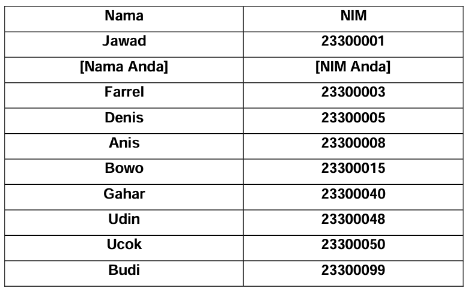

# <h1 align="center">Laporan Praktikum Modul Linked List Circular dan Non-Circular</h1>
<p align="center">Valisha Atthalia Naura Irfan - 2311102160</p>

## Dasar Teori

Circular Linked List adalah suatu linked list yang tidak memiliki nilai nil / NULL untuk medan sambungannya. Circular Linked List dapat dilakukan terhadap Singly Linked List maupun Doubly Linked  List. Dalam Circular Linked List tidak terdapat suatu simpul yang  bernilai NULL. Hal ini terjadi karena simpul terakhir dihubungkan  terhadap simpul pertama untuk Single Linked List dan simpul pertama dengan simpul terakhir saling terhubung untuk Double Linked List. Semua simpul berhak diperlakukan sebagai simpul depan.
1. Circular single linked list 
Hampir sama dengan Singly Linked List, hanya saja 
simpul terakhir akan dihubungkan ke simpul pertama 
sehingga berbentuk melingkar. Pendeklarasian dan 
operasi yang ada di Singly Linked List juga berlaku di 
Circular Singly Linked List, yang perlu dijaga adalah 
bahwa simpul terakhir harus selalu terhubung ke simpul 
pertama.
2. Double Circluar Linked List
Double Circular Linked List adalah jenis linked list di mana field pointer-nya terdiri dari dua buah pointer yang bergerak ke dua arah, yaitu prev dan next. Selain itu, pointer next pada Double Circular Linked List akan menunjuk kembali pada elemen tersebut sendiri, menciptakan sebuah pola sirkular. Dengan kata lain, baik pointer next maupun pointer prev pada Double Circular Linked List akan membentuk sebuah loop yang menghubungkan setiap elemen dalam struktur data ini secara berputar.
3. Double Linked List Non Circular
Double Linked List Non Circular, saat berada pada node yang berfungsi sebagai head atau node pertama dalam linked list, nilai dari pointer prev pada node tersebut akan diatur menjadi NULL. Hal ini dikarenakan node head tidak memiliki node sebelumnya. Sedangkan untuk node yang berfungsi sebagai tail atau node terakhir dalam linked list, nilai dari pointer next pada node tersebut akan diatur untuk menunjuk ke NULL, menandakan akhir dari linked list tersebut.
4. Double Circular Linked List
Double Circular Linked List adalah jenis daftar terhubung di mana field pointer-nya terdiri dari dua buah pointer yang bergerak ke dua arah, yaitu prev dan next. Selain itu, pointer next pada Double Circular Linked List akan menunjuk kembali pada elemen tersebut sendiri, menciptakan pola sirkular. Dengan kata lain, baik pointer prev maupun pointer next akan membentuk sebuah loop yang menghubungkan setiap elemen dalam struktur data ini s

## Guided 

### 1. [Link List Non-Circular]

```C++
#include <iostream>
using namespace std;

/// PROGRAM SINGLE LINKED LIST NON-CIRCULAR
// Deklarasi Struct Node
struct Node{
    int data;
    Node *next;
    };
    Node *head;
    Node *tail;

// Inisialisasi Node
void init(){
    head = NULL;
    tail = NULL;
    }

// Pengecekan
bool isEmpty(){
    if (head == NULL)
        return true;
    else
        return false;
    }

// Tambah Depan
void insertDepan(int nilai){
    // Buat Node baru
    Node *baru = new Node;
    baru->data = nilai;
    baru->next = NULL;
    if (isEmpty() == true)
    {
        head = tail = baru;
        tail->next = NULL;
    }else {
        baru->next = head;
        head = baru;
        }
    }

// Tambah Belakang
void insertBelakang(int nilai){
    // Buat Node baru
    Node *baru = new Node;
    baru->data = nilai;
    baru->next = NULL;
    if (isEmpty() == true){
        head = tail = baru;
        tail->next = NULL;
    }else {
        tail->next = baru;
        tail = baru;
        }
    }
        
// Hitung Jumlah List
int hitungList(){
    Node *hitung;
    hitung = head;
    int jumlah = 0;
    while (hitung != NULL){
        jumlah++;
        hitung = hitung->next;
    }
    return jumlah;
}

// Tambah Tengah
void insertTengah(int data, int posisi){
    if (posisi < 1 || posisi > hitungList()){
        cout << "Posisi diluar jangkauan" << endl;
        }
    else if (posisi == 1){
        cout << "Posisi bukan posisi tengah" << endl;
    }else {
        Node *baru, *bantu;
        baru = new Node();
        baru->data = data;

        // tranversing
        bantu = head;
        int nomor = 1;
        while (nomor < posisi - 1){
            bantu = bantu->next;
            nomor++;
        }
        baru->next = bantu->next;
        bantu->next = baru;
    }
}

// Hapus Depan
void hapusDepan(){
    Node *hapus;
    if (isEmpty() == false){
        if (head->next != NULL){
            hapus = head;
            head = head->next;
            delete hapus;
            head = tail = NULL;
        }else{
            cout << "List kosong!" << endl;
        }
    }
}
// Hapus Belakang
void hapusBelakang(){
    Node *hapus;
    Node *bantu;
    if (isEmpty() == false){
        if (head != tail){
            hapus = tail;
            bantu = head;
            while (bantu->next != tail){
                bantu = bantu->next;
            }
            tail = bantu;
            tail->next = NULL;
            delete hapus;
        }else{
            head = tail = NULL;
        }
    }else{
        cout << "List kosong!" << endl;
    }
}

// Hapus Tengah
void hapusTengah(int posisi){
    Node *bantu, *hapus, *sebelum;
    if (posisi < 1 || posisi > hitungList()){
        cout << "Posisi di luar jangkauan" << endl;
    }
    else if (posisi == 1){
        cout << "Posisi bukan posisi tengah" << endl;
    }else{
        int nomor = 1;
        bantu = head;
        while (nomor <= posisi){
            if (nomor == posisi - 1){
                sebelum = bantu;
            }
            if (nomor == posisi){
                hapus = bantu;
                }
                bantu = bantu->next;
                nomor++;
            }
            sebelum->next = bantu;
            delete hapus;
        }
    }

// Ubah Depan
void ubahDepan(int data){
    if (isEmpty() == 0){
        head->data = data;
        }else{
            cout << "List masih kosong!" << endl;
        }
    }

// Ubah Tengah
void ubahTengah(int data, int posisi){
Node *bantu;
if (isEmpty() == 0){
    if (posisi < 1 || posisi > hitungList()){
        cout << "Posisi di luar jangkauan" << endl;
        }
        else if (posisi == 1){
            cout << "Posisi bukan posisi tengah" << endl;
        }else{
            bantu = head;
            int nomor = 1;
            while (nomor < posisi){
                bantu = bantu->next;
                nomor++;
            }
            bantu->data = data;
        }
    }else{
    cout << "List masih kosong!" << endl;
    }
}

// Ubah Belakang
void ubahBelakang(int data){
    if (isEmpty() == 0){
        tail->data = data;
    }else{
        cout << "List masih kosong!" << endl;
    }
}

// Hapus List
void clearList(){
    Node *bantu, *hapus;
    bantu = head;
    while (bantu != NULL){
        hapus = bantu;
        bantu = bantu->next;
        delete hapus;
    }
    head = tail = NULL;
    cout << "List berhasil terhapus!" << endl;
}

// Tampilkan List
void tampil(){
    Node *bantu;
    bantu = head;
    if (isEmpty() == false){
        while (bantu != NULL){
            cout << bantu->data << ends;
            bantu = bantu->next;
        }
        cout << endl;
    }else{
        cout << "List masih kosong!" << endl;
    }
}

int main(){
    init();
    insertDepan(3);
    tampil();
    insertBelakang(5);
    tampil();
    insertDepan(2);
    tampil();
    insertDepan(1);
    tampil();
    hapusDepan();
    tampil();
    hapusBelakang();
    tampil();
    insertTengah(7, 2);
    tampil();
    hapusTengah(2);
    tampil();
    ubahDepan(1);
    tampil();
    ubahBelakang(8);
    tampil();
    ubahTengah(11, 2);
    tampil();
    return 0;
}
```
Program ini menunjukkan cara mengimplementasikan operasi dasar pada Single Linked List Non-Circular dalam bahasa C++. Pengguna dapat memodifikasi program ini untuk menambahkan operasi lain, seperti mencari data, mengurutkan data, dan sebagainya.

### 2. [Link List Non-Circular]
```C++
#include <iostream>
using namespace std;

// Deklarasi Struct Node
struct Node
{
    string data;
    Node* next;
};

Node* head, * tail, * baru, * bantu, * hapus;

void init()
{
    head = NULL;
    tail = head;
}

// Pengecekan
int isEmpty()
{
    if (head == NULL)
        return 1; // true
    else
        return 0; // false
}

// Buat Node Baru
void buatNode(string data)
{
    baru = new Node;
    baru->data = data;
    baru->next = NULL;
}

// Hitung List
int hitungList()
{
    bantu = head;
    int jumlah = 0;
    while (bantu != NULL)
    {
        jumlah++;
        bantu = bantu->next;
    }
    return jumlah;
}

// Tambah Depan
void insertDepan(string data)
{
    // Buat Node baru
    buatNode(data);

    if (isEmpty() == 1)
    {
        head = baru;
        tail = head;
        baru->next = head;
    }
    else
    {
        while (tail->next != head)
        {
            tail = tail->next;
        }
        baru->next = head;
        head = baru;
        tail->next = head;
    }
}

// Tambah Belakang
void insertBelakang(string data)
{
    // Buat Node baru
    buatNode(data);

    if (isEmpty() == 1)
    {
        head = baru;
        tail = head;
        baru->next = head;
    }
    else
    {
        while (tail->next != head)
        {
            tail = tail->next;
        }
        tail->next = baru;
        baru->next = head;
    }
}

// Tambah Tengah
void insertTengah(string data, int posisi)
{
    if (isEmpty() == 1)
    {
        head = baru;
        tail = head;
        baru->next = head;
    }
    else
    {
        baru->data = data;
        // transversing
        int nomor = 1;
        bantu = head;
        while (nomor < posisi - 1)
        {
            bantu = bantu->next;
            nomor++;
        }
        baru->next = bantu->next;
        bantu->next = baru;
    }
}

// Hapus Depan
void hapusDepan()
{
    if (isEmpty() == 0)
    {
        hapus = head;
        tail = head;
        if (hapus->next == head)
        {
            head = NULL;
            tail = NULL;
            delete hapus;
        }
        else
        {
            while (tail->next != hapus)
            {
                tail = tail->next;
            }
            head = head->next;
            tail->next = head;
            hapus->next = NULL;
            delete hapus;
        }
    }
    else
    {
        cout << "List masih kosong!" << endl;
    }
}

// Hapus Belakang
void hapusBelakang()
{
    if (isEmpty() == 0)
    {
        hapus = head;
        tail = head;
        if (hapus->next == head)
        {
            head = NULL;
            tail = NULL;
            delete hapus;
        }
        else
        {
            while (hapus->next != head)
            {
                hapus = hapus->next;
            }
            while (tail->next != hapus)
            {
                tail = tail->next;
            }
            tail->next = head;
            hapus->next = NULL;
            delete hapus;
        }
    }
    else
    {
        cout << "List masih kosong!" << endl;
    }
}

// Hapus Tengah
void hapusTengah(int posisi)
{
    if (isEmpty() == 0)
    {
        // transversing
        int nomor = 1;
        bantu = head;
        while (nomor < posisi - 1)
        {
            bantu = bantu->next;
            nomor++;
        }
        hapus = bantu->next;
        bantu->next = hapus->next;
        delete hapus;
    }
    else
    {
        cout << "List masih kosong!" << endl;
    }
}

// Hapus List
void clearList()
{
    if (head != NULL)
    {
        hapus = head->next;
        while (hapus != head)
        {
            bantu = hapus->next;
            delete hapus;
            hapus = bantu;
        }
        delete head;
        head = NULL;
    }
    cout << "List berhasil terhapus!" << endl;
}

// Tampilkan List
void tampil()
{
    if (isEmpty() == 0)
    {
        tail = head;
        do
        {
            cout << tail->data << ends;
            tail = tail->next;
        } while (tail != head);
        cout << endl;
    }
    else
    {
        cout << "List masih kosong!" << endl;
    }
}

int main()
{
    init();
    insertDepan("Ayam");
    tampil();
    insertDepan("Bebek");
    tampil();
    insertBelakang("Cicak");
    tampil();
    insertBelakang("Domba");
    tampil();
    hapusBelakang();
    tampil();
    hapusDepan();
    tampil();
    insertTengah("Sapi", 2);
    tampil();
    hapusTengah(2);
    tampil();
    return 0;
}
```
Program ini menunjukkan cara mengimplementasikan operasi dasar pada Single Linked List Circular dalam bahasa C++. Anda dapat memodifikasi program ini untuk menambahkan operasi lain, seperti mencari data, mengurutkan data, dan sebagainya.

## Unguided 
### [Buatlah program menu Linked List Non Circular untuk menyimpan Nama dan NIM mahasiswa, dengan menggunakan input dari user. Setelah membuat menu tersebut, masukkan data sesuai urutan berikut, lalu tampilkan data yang telah dimasukkan.]
1. Masukkan data sesuai urutan berikut. (Gunakan insert depan, belakang atau tengah). Data kedua yang dimasukkan adalah nama dan NIM anda.

2. Tambahkan data berikut diantara Farrel dan Denis: Wati 2330004
3. Hapus data Denis
4. Tambahkan data berikut di awal: Owi 2330000
5. Tambahkan data berikut di akhir: David 23300100
6. Ubah data Udin menjadi data berikut: Idin 23300045
7. Ubah data terkahir menjadi berikut: Lucy 23300101
8. Hapus data awal
9. Ubah data awal menjadi berikut: Bagas 2330002
10. Hapus data akhir
11. Tampilkan seluruh data

```C++
// Valisha Atthalia Naura Irfan
// 2311102160

#include <iostream>
using namespace std;

/// PROGRAM SINGLE LINKED LIST NON-CIRCULAR
// Deklarasi Struct Node
struct Node
{
    string nama;
    string nim;
    Node *next;
};
Node *head;
Node *tail;

// Inisialisasi Node
void init()
{
    head = NULL;
    tail = NULL;
}

// Pengecekan
bool isEmpty()
{
    if (head == NULL)
        return true;
    else
        return false;
}

// Tambah Depan
void insertDepan(string nama, string nim)
{
    // Buat Node baru
    Node *baru = new Node;
    baru->nama = nama;
    baru->nim = nim;
    baru->next = NULL;
    if (isEmpty() == true)
    {
        head = tail = baru;
        tail->next = NULL;
    }
    else
    {
    baru->next = head;
    head = baru;
    }
}

// Tambah Belakang
void insertBelakang(string nama, string nim)
{
    // Buat Node baru
    Node *baru = new Node;
    baru->nama = nama;
    baru->nim = nim;
    baru->next = NULL;
    if (isEmpty() == true)
    {
    head = tail = baru;
    tail->next = NULL;
    }
    else
    {
    tail->next = baru;
    tail = baru;
    }
}

// Hitung Jumlah List
int hitungList()
{
    Node *hitung;
    hitung = head;
    int jumlah = 0;
    while (hitung != NULL)
    {
        jumlah++;
        hitung = hitung->next;
    }
    return jumlah;
}

// Tambah Tengah
void insertTengah(string nama, string nim, int posisi)
{
    if (posisi < 1 || posisi > hitungList())
    {
    cout << "Posisi diluar jangkauan" << endl;
    }
    else if (posisi == 1)
    {
        cout << "Posisi bukan posisi tengah" << endl;
    }
    else
    {
        Node *baru, *bantu;
        baru = new Node();
        baru->nama = nama;
        baru->nim = nim;
        // tranversing
        bantu = head;
        int nomor = 1;
        while (nomor < posisi - 1)
        {
            bantu = bantu->next;
            nomor++;
        }
        baru->next = bantu->next;
        bantu->next = baru;
    }
}

// Hapus Depan
void hapusDepan()
{
    Node *hapus;
    if (isEmpty() == false)
    {
        if (head->next != NULL)
        {
            hapus = head;
            head = head->next;
            delete hapus;
        }
        else
        {
            head = tail = NULL;
        }
    }
    else
    {
        cout << "List kosong!" << endl;
    }
}

// Hapus Belakang
void hapusBelakang()
{
    Node *hapus;
    Node *bantu;
    if (isEmpty() == false)
    {
        if (head != tail)
        {
            hapus = tail;
            bantu = head;
            while (bantu->next != tail)
            {
                bantu = bantu->next;
            }
            tail = bantu;
            tail->next = NULL;
            delete hapus;
        }
        else
        {
            head = tail = NULL;
        }
    }
    else
    {
        cout << "List kosong!" << endl;
    }
}

// Hapus Tengah
void hapusTengah(int posisi)
{
    Node *hapus, *bantu, *bantu2;
    if (posisi < 1 || posisi > hitungList())
    {
    cout << "Posisi di luar jangkauan" << endl;
    }
    else if (posisi == 1)
    {
    cout << "Posisi bukan posisi tengah" << endl;
    }
    else
    {
        int nomor = 1;
        bantu = head;
        while (nomor <= posisi)
        {
            if (nomor == posisi - 1)
            {
                bantu2 = bantu;
            }
            if (nomor == posisi)
            {
                cout << "Data " << bantu->nama;
                hapus = bantu;
            }
            bantu = bantu->next;
            nomor++;
        }
        bantu2->next = bantu;
        delete hapus;
    }
}

// Ubah Depan
void ubahDepan(string nama, string nim)
{
    cout << "Data " << head->nama;
    if (isEmpty() == false)
    {
        head->nama = nama;
        head->nim = nim;
    }
    else
    {
        cout << "List masih kosong!" << endl;
    }
}

// Ubah Tengah
void ubahTengah(string nama, string nim, int posisi)
{
    Node *bantu;
    if (isEmpty() == false)
    {
        if (posisi < 1 || posisi > hitungList())
        {
            cout << "Posisi di luar jangkauan" << endl;
        }
        else if (posisi == 1)
        {
            cout << "Posisi bukan posisi tengah" << endl;
        }
        else
        {
            bantu = head;
            int nomor = 1;
            while (nomor < posisi)
            {
                bantu = bantu->next;
                nomor++;
            }
            cout << "Data " << bantu->nama;
            bantu->nama = nama;
            bantu->nim = nim;
        }
    }
    else
    {
        cout << "List masih kosong!" << endl;
    }
}

// Ubah Belakang
void ubahBelakang(string nama, string nim)
{
    cout << "Data " << tail->nama;
    if (isEmpty() == false)
    {
        tail->nama = nama;
        tail->nim = nim;
    }
    else
    {
        cout << "List masih kosong!" << endl;
    }
}

// Hapus List
void clearList()
{
    Node *bantu, *hapus;
    bantu = head;
    while (bantu != NULL)
    {
        hapus = bantu;
        bantu = bantu->next;
        delete hapus;
    }
    head = tail = NULL;
    cout << "List berhasil terhapus!" << endl;
}

// Tampilkan List
void tampil()
{
    cout << "DATA MAHASISWA" << endl;
    cout << "Nama    NIM" << endl;
    Node *bantu;
    bantu = head;
    if (isEmpty() == false)
    {
        while (bantu != NULL)
        {
            cout << bantu->nama << "\t";
            cout << bantu->nim << endl;
            bantu = bantu->next;
        }
        cout << endl;
    }
    else
    {
        cout << "List masih kosong!" << endl;
    }
}

int main()
{
    init();
    string nama, nim;
    int pilihan, posisi;
    char ulang;
    do
    {
        cout << endl;
        cout << "Valisha Atthalia Naura Irfan" << endl;
        cout << "2311102160" << endl;
        cout << "Program Single Linked List Non Circular" << endl;
        cout << "1. Tambah Data Depan" << endl;
        cout << "2. Tambah Data Belakang" << endl;
        cout << "3. Tambah Data Tengah" << endl;
        cout << "4. Ubah Data Depan" << endl;
        cout << "5. Ubah Data Belakang" << endl;
        cout << "6. Ubah Data Tengah" << endl;
        cout << "7. Hapus Data Depan" << endl;
        cout << "8. Hapus Data Belakang" << endl;
        cout << "9. Hapus Data Tengah" << endl;
        cout << "10. Hapus List" << endl;
        cout << "11. Tampilkan" << endl;
        cout << "12. Keluar" << endl;
        cout << "Masukkan Pilihan: ";
        cin >> pilihan;
        cout << endl;

        switch (pilihan)
        {
        case 1:
        {
            cout << "Masukkan Nama : ";
            cin >> nama;
            cout << "Masukkan NIM : ";
            cin >> nim;
            insertDepan(nama, nim);
            cout << "Data " << nama << " berhasil diinput!";
            cout << endl;
            break;
        }
        case 2:
        {
            cout << "Masukkan Nama : ";
            cin >> nama;
            cout << "Masukkan NIM : ";
            cin >> nim;
            insertBelakang(nama, nim);
            cout << "Data " << nama << " berhasil diinput!";
            cout << endl;
            break;
        }
        case 3:
        {
            cout << "Masukkan Nama : ";
            cin >> nama;
            cout << "Masukkan NIM : ";
            cin >> nim;
            cout << "Masukkan Posisi : ";
            cin >> posisi;
            insertTengah(nama, nim, posisi);
            cout << "Data " << nama << " berhasil diinput!";
            cout << endl;
            break;
        }
        case 4:
        {
            cout << "Masukkan Nama : ";
            cin >> nama;
            cout << "Masukkan NIM : ";
            cin >> nim;
            ubahDepan(nama, nim);
            cout << " telah diganti dengan data " << nama << "!\n";
            break;
        }
        case 5:
        {
            cout << "Masukkan Nama : ";
            cin >> nama;
            cout << "Masukkan NIM : ";
            cin >> nim;
            ubahBelakang(nama, nim);
            cout << " telah diganti dengan data " << nama << "!\n";
            break;
        }
        case 6:
        {
            cout << "Masukkan Nama : ";
            cin >> nama;
            cout << "Masukkan NIM : ";
            cin >> nim;
            cout << "Masukkan Posisi : ";
            cin >> posisi;
            ubahTengah(nama, nim, posisi);
            cout << " telah diganti dengan data " << nama << "!\n";
            break;
        }
        case 7:
        {
            cout << "Data " << head->nama << " berhasil dihapus!\n";
            hapusDepan();
            break;
        }
        case 8:
        {
            cout << "Data " << tail->nama << " berhasil dihapus!\n";
            hapusBelakang();
            break;
        }
        case 9:
        {
            cout << "Masukkan Posisi : ";
            cin >> posisi;
            hapusTengah(posisi);
            cout << " berhasil dihapus!\n";
            break;
        }
        case 10:
        {
            clearList();
            cout << "Seluruh Data Telah Dihapus" << endl;
            break;
        }
        case 11:
        {
            tampil();
            break;
        }
        case 12:
        {
            return 0;
        }
        default:
            cout << "Pilihan tidak valid!" << endl;
            break;
        }
        cout << "Lanjutkan memilih menu?(y/n): ";
        cin >> ulang;
    } while (ulang == 'y');
    return 0;
}
```
#### Output:
## 1. Masukkan data sesuai urutan berikut. (Gunakan insert depan, belakang atau tengah). Data kedua yang dimasukkan adalah nama dan NIM anda.


## 2. Tambahkan data berikut diantara Farrel dan Denis: Wati 2330004


## 3. Hapus data Denis

## 4. Tambahkan data berikut di awal: Owi 2330000

## 5. Tambahkan data berikut di akhir: David 23300100

## 6. Ubah data Udin menjadi data berikut: Idin 23300045

## 7. Ubah data terakhir menjadi berikut: Lucy 23300101

## 8. Hapus data awal

## 9. Ubah data awal menjadi berikut: Bagas 2330002

## 10. Hapus data akhir

## 11. Tampilkan seluruh data


Kode program ini mendemonstrasikan implementasi Single Linked List Non-Circular dalam bahasa C++. Program ini memungkinkan pengguna untuk melakukan berbagai operasi pada list, seperti:

1. Menambahkan data di depan, belakang, dan tengah list
2. Mengubah data di depan, belakang, dan tengah list
3. Menghapus data di depan, belakang, dan tengah list
4. Menampilkan seluruh data dalam list
5. Menghapus seluruh data dalam list

## Kesimpulan
Kode program ini merupakan contoh yang baik untuk mempelajari cara implementasi Single Linked List Non-Circular dalam bahasa C++. Program ini mudah dipahami dan dimodifikasi sesuai kebutuhan.

## Referensi
[1] Nugraha, Muhammad. "Dasar Pemrograman Dengan C++, Materi Paling Dasar untuk Menjadi Programmer Berbagai Platform" (2021)

[2] Dr. Joseph Teguh Santoso., Struktur Data dan ALgoritma. Semarang: Yayasan Prima Agus Teknik, 2021.