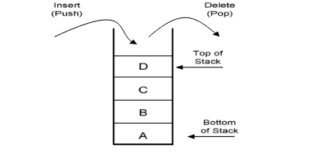

# <h1 align="center">Laporan Praktikum Modul Stack</h1>
<p align="center">Valisha Atthalia Naura Irfan - 2311102160</p>

## Dasar Teori

Stack adalah struktur data sederhana yang digunakan untuk menyimpan data (mirip dengan Linked Lists). Dalam tumpukan, urutan kedatangan data penting. Sebuah tumpukan piring di kafetaria adalah contoh bagus dari tumpukan. Piring ditambahkan ke tumpukan saat mereka dibersihkan dan ditempatkan di bagian atas. Ketika sebuah piring dibutuhkan, diambil dari bagian atas tumpukan. Piring pertama yang ditempatkan di tumpukan adalah yang terakhir digunakan.


Operasi pada stack melibatkan serangkaian fungsi yang memberikan kita kemampuan untuk berinteraksi dengan struktur data ini. Mari kita jabarkan beberapa operasi dasar yang dapat kita lakukan pada stack:

 - a. Push (Masukkan): Bayangkan menambahkan satu per satu buku ke tumpukan yang sudah Anda susun. Setiap buku yang Anda tambahkan diletakkan di atas tumpukan, sehingga semakin tinggi tumpukan tersebut.
 - b. Pop (Keluarkan): Sekarang, bayangkan mengambil buku dari atas tumpukan yang telah Anda susun. Ketika Anda mengambil buku, yang Anda ambil adalah buku paling atas, yang paling terlihat.
 - c. Top (Atas): Ketika Anda ingin melihat judul buku teratas di tumpukan tanpa mengganggu susunannya.
 - d. IsEmpty (Kosong): Anda mungkin ingin memeriksa apakah tumpukan buku kosong atau masih ada buku yang tersisa di dalamnya.
 - e. IsFull (Penuh): Namun, jika Anda hanya memiliki sedikit ruang untuk menambahkan buku baru, Anda perlu memeriksa apakah tumpukan sudah penuh atau masih ada ruang kosong
 - f. Size (Ukuran): Ketika Anda ingin tahu berapa banyak buku yang telah Anda susun di tumpukan tersebut.
 - g. Peek (Lihat): Jika Anda ingin melihat buku tertentu di dalam tumpukan tanpa harus mengambilnya dari susunannya.
 - h. Clear (Hapus Semua): Ketika tiba saatnya untuk membersihkan tumpukan, Anda ingin mengosongkan semua buku dari tumpukan.
 - i. Search (Cari): Dan terakhir, jika Anda ingin menemukan apakah buku tertentu ada di dalam tumpukan, Anda bisa mencari dengan cepat.


## Guided 

### 1. [Stack]

```C++
#include<iostream>

using namespace std;

string arrayBuku[5];
int maksimal = 5, top = 0;

bool isFull(){
    return (top == maksimal);
}

bool isEmpty(){
    return (top == 0);
}

void pushArrayBuku(string data){
    if(isFull()){
        cout << "Data telah penuh" << endl;
    } else {
        arrayBuku[top] = data;
        top++;
    }
}

void popArrayBuku(){
    if(isEmpty()){
        cout << "tidak ada data yang dihapus" << endl;
    } else {
        arrayBuku[top - 1] = "";
        top--;
    }
}

void peekArrayBuku(int posisi){
    if(isEmpty()){
        cout << "tidak ada data yang bisa dilihat" << endl;
    } else {
        int index = top;
        for(int i = 1; i <= posisi; i++){
            index--;
        }
        cout << "Posisi ke-" << posisi << " adalah " << arrayBuku[index] << endl;
    }
}

int countStack(){
    return top;
}

void changeArrayBuku(int posisi, string data){
    if(posisi > top){
        cout << "Posisi melebihi data yang ada" << endl;
    } else {
        int index = top;
        for(int i = 1; i <= posisi; i++){
            index--;
        }
        arrayBuku[index] = data;
    }
}

void destroyArrayBuku(){
    for(int i = top; i >= 0; i--){
        arrayBuku[i] = "";
    }
    top = 0;
}

void cetakArrayBuku(){
    if(isEmpty()){
        cout << "tidak ada data yang bisa dicetak" << endl;
    } else {
        for (int i = top - 1; i >= 0; i--){
            cout << arrayBuku[i] << endl;
        }
    }
}

int main(){
    pushArrayBuku("Kalkulus");
    pushArrayBuku("Struktur Data");
    pushArrayBuku("Matematika Diskrit");
    pushArrayBuku("Dasar Multimedia");
    pushArrayBuku("Inggris");

    cetakArrayBuku();
    cout << "\n";

    cout << "Apakah data stack penuh? " << isFull() << endl;

    cout << "Apakah data stack kosong? " << isEmpty() << endl;
    cout << "\n";

    peekArrayBuku(2);

    popArrayBuku();
    cout << "\n";

    cout << "Banyaknya data = " << countStack() << endl;

    changeArrayBuku(2, "Bahasa Jerman");

    cetakArrayBuku();
    cout << "\n";

    destroyArrayBuku();

    cout << "Jumlah data setelah dihapus = " << countStack() << endl;

    cetakArrayBuku();

    return 0;
}
```
Kode program ini mengimplementasikan struktur data stack (tumpukan) menggunakan array sebagai wadah datanya. Stack memiliki operasi dasar seperti memasukkan (push), mengeluarkan (pop), mengintip (peek), memeriksa penuh/kosongnya stack, mengubah elemen pada posisi tertentu, menghapus seluruh stack (destroy), dan mencetak isi stack.

## Unguided 

### 1. [Buatlah program untuk menentukan apakah kalimat tersebut yang diinputkan dalam program stack adalah palindrom/tidak. Palindrom kalimat yang dibaca dari depan dan belakang sama. Jelaskan bagaimana cara kerja programnya!]

```C++
#include <iostream>
#include <string>
#include <stack>

using namespace std;

string bersihkan_dan_ubah_ke_huruf_kecil_160 (string str) {
    string cleanStr;
    for (char &c : str) {
        if (isalpha(c)) {
            cleanStr += tolower(c);
        }
    }
    return cleanStr;
}

bool Palindrom_160 (string str) {
    stack<char> charStack;
    int length = str.length();

    for (int i = 0; i < length / 2; i++) {
        charStack.push(str[i]);
    }

    int start = length / 2;
    if (length % 2 != 0) {
        start++;
    }
    for (int i = start; i < length; i++) {
        if (charStack.empty() || str[i] != charStack.top()) {
            return false;
        }
        charStack.pop();
    }

    return true;
}

int main() {
    char lanjutkan_160;
    do {
        string input;
        cout << "\nMasukkan kata atau kalimat: ";
        getline(cin, input);

        string membersihkan_input_160 = bersihkan_dan_ubah_ke_huruf_kecil_160(input);

        if (Palindrom_160 (membersihkan_input_160)) {
            cout << "Kata atau kalimat tersebut adalah : Palindrom" << endl;
        } else {
            cout << "Kata atau kalimat tersebut adalah : Bukan Palindrom" << endl;
        }

        cout << "Ingin memasukkan kata atau kalimat lain? (y/n): ";
        cin >> lanjutkan_160;
        cin.ignore();
    } while (lanjutkan_160 == 'y' || lanjutkan_160 == 'Y');

    return 0;
}

```
#### Output:


Kode program ini memungkinkan pengguna untuk memasukkan kata/kalimat dan program akan memeriksa apakah kata/kalimat tersebut merupakan palindrom atau bukan.  Program ini menggunakan stack untuk menyimpan dan membandingkan karakter dalam string.

### 2. [Buatlah program untuk melakukan pembalikan terhadap kalimat menggunakan stack dengan minimal 3 kata. Jelaskan output program dan source codenya beserta operasi/fungsi yang dibuat?]

```C++
#include <iostream>
#include <stack>
#include <string>

using namespace std;

string BalikkanKata_160(string kalimat_160) {
    stack<char> karakterStack_160;

    // Operasi PUSH
    // Memasukkan setiap karakter dari kalimat ke dalam stack
    for (char karakterKata : kalimat_160) {
        karakterStack_160.push(karakterKata);
    }

    string BalikkanKata_160 = " ";

    // Operasi POP
    // Mengeluarkan setiap karakter dari stack untuk membentuk kalimat terbalik
    
    while (!karakterStack_160.empty()) {
        BalikkanKata_160 += karakterStack_160.top();
        karakterStack_160.pop();
    }

    return BalikkanKata_160;
}

int main() {
    string kalimat_160;

    cout << "Masukkan Kata ";
    getline(cin, kalimat_160);

    string kalimatTerbalik = BalikkanKata_160(kalimat_160);
    cout << "DataStack Array : " <<  endl;
    cout << "Data : " << kalimatTerbalik << endl;

    return 0;
}modu
```

### Output


Kode ini mengambil input berupa string (kalimat), membalik urutan karakternya menggunakan stack (tumpukan), dan kemudian mencetak string yang sudah dibalik.

## Kesimpulan
Ringkasan dan interpretasi pandangan kalia dari hasil praktikum dan pembelajaran yang didapat[1].

## Referensi
[1] I. Holm, Narrator, and J. Fullerton-Smith, Producer, How to Build a Human [DVD]. London: BBC; 2002.